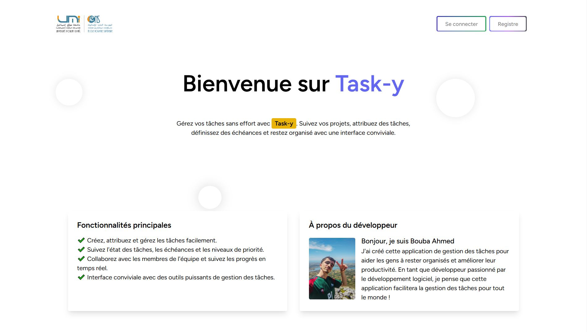

# 🚀 Tasky - Plateforme Collaborative de Gestion de Projets  
**Solution moderne pour la gestion des utilisateurs, projets et tâches**  

[](https://laravel.com)  
[](https://reactjs.org)  
[](https://inertiajs.com)  
[](https://opensource.org/licenses/MIT)  

---

## 📋 Présentation du Projet  
**Tasky** est une application web développée avec **Laravel**, **React.js**, et **Inertia.js** pour simplifier la gestion collaborative de projets et de tâches. Conçue pour les équipes, elle offre :  
✅ **Gestion centralisée** des utilisateurs, projets et tâches  
✅ **Tableau de bord interactif** avec suivi en temps réel  
✅ **Interface réactive** optimisée pour tous les écrans  
✅ **Authentification sécurisée** via Laravel Breeze  

---

## 🎯 Fonctionnalités Principales  

### **Gestion des Utilisateurs**  
- Inscription, connexion, et réinitialisation de mot de passe  
- Rôles personnalisés (Administrateur, Membre)  
- Profils utilisateurs avec mise à jour des informations  

### **Gestion des Projets**  
- Création/Modification de projets avec dates et descriptions  
- Assignation de projets à des équipes  
- Suivi des statuts (En cours, Terminé, En attente)  

### **Gestion des Tâches**  
- Création de tâches avec priorités et deadlines  
- Assignation à des utilisateurs spécifiques  
- Mise à jour dynamique des statuts (À faire/En cours/Terminé)  

### **Tableau de Bord**  
- Visualisation des statistiques d'avancement  
- Graphiques interactifs pour le suivi des projets et tâches  
- Recherche et filtres avancés  

---

## 🛠 Architecture Technique  
**Backend**  
- **Laravel 10** : Routage, modèles, et contrôleurs  
- **MySQL** : Base de données relationnelle  
- **Sanctum** : Authentification sécurisée  

**Frontend**  
- **React.js 18** : Composants modulaires et réactifs  
- **Inertia.js** : Liaison fluide entre Laravel et React  
- **Tailwind CSS** : Design responsive  

---

## 🚀 Installation  

### Prérequis  
- PHP 8.1+  
- Composer 2.x  
- Node.js 16+  
- MySQL 8.x  

### Étapes  
1. Clonez le dépôt :  
   ```bash  
   git clone https://github.com/BoubaAhmed/Task-manager-with-Inertia.git  
   cd Task-manager-with-Inertia  
   ```  

2. Installez les dépendances :  
   ```bash  
   composer install  
   npm install  
   ```  

3. Configurez le fichier `.env` :  
   ```ini  
   DB_CONNECTION=mysql  
   DB_HOST=127.0.0.1  
   DB_PORT=3306  
   DB_DATABASE=tasky  
   DB_USERNAME=root  
   DB_PASSWORD=  
   ```  

4. Générez la clé d'application :  
   ```bash  
   php artisan key:generate  
   ```  

5. Migrez la base de données :  
   ```bash  
   php artisan migrate --seed  
   ```  

6. Lancez l'application :  
   ```bash  
   php artisan serve  
   npm run dev  
   ```  

Accédez à l'application : [http://localhost:8000](http://localhost:8000)  

---

## 📸 Captures d'Écran  
| Page d'acceuil | Tableau de Bord | Gestion des Tâches |  
|--------------------|------------------|---------------------|  
|  |  |  |  

---

## 🧪 Tests  
Exécutez les tests unitaires et fonctionnels :  
```bash  
php artisan test  
```  
**Résultats attendus** :  
```  
Tests: 25 passed (61 assertions)  
Duration: 36.09s  
```  

---

## 🤝 Contribution  
1. Forkez le dépôt  
2. Créez une branche :  
   ```bash  
   git checkout -b feature/nouvelle-fonctionnalite  
   ```  
3. Committez vos modifications :  
   ```bash  
   git commit -m 'Ajout d'une fonctionnalité'  
   ```  
4. Pushez vers la branche :  
   ```bash  
   git push origin feature/nouvelle-fonctionnalite  
   ```  
5. Ouvrez une Pull Request  

---

## 📧 Contact  
**Bouba Ahmed** - [ahmedbouba383@gmail.com](mailto:ahmedbouba383@gmail.com)  
**Dépôt GitHub** : [https://github.com/BoubaAhmed/Task-manager-with-Inertia](https://github.com/BoubaAhmed/Task-manager-with-Inertia)  

---

**Optimisez votre gestion de projets dès aujourd'hui avec Tasky !** 🚀  
