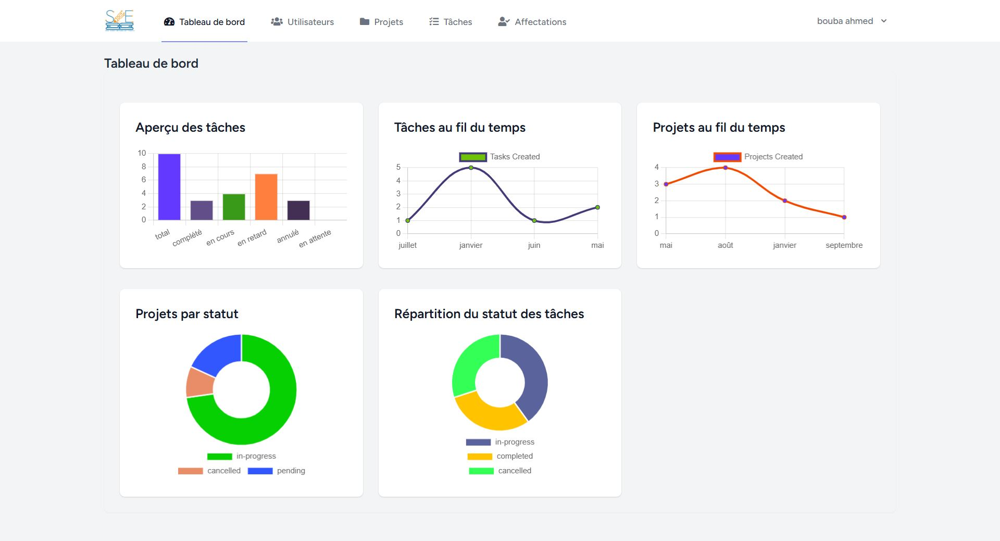
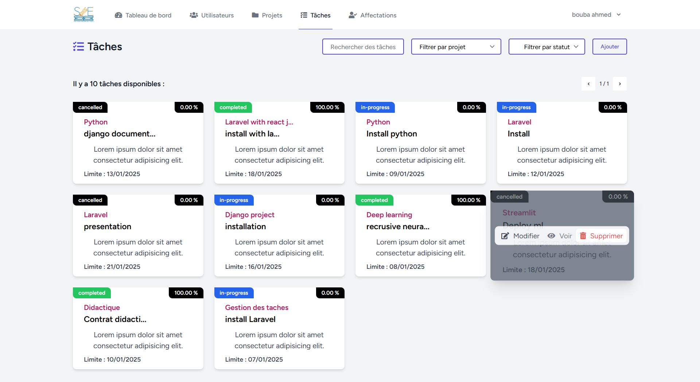
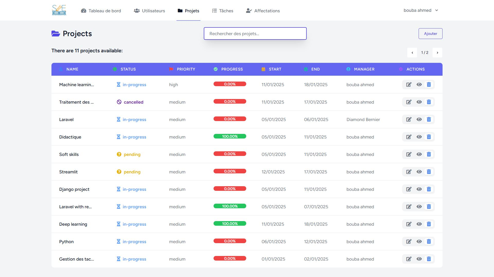

Got it! Let's create a **professional and polished README** for your **Tasky** project, built with **React.js**, **Laravel**, and **Inertia.js**. Here's the updated version:

---

```markdown
# 🚀 Tasky - Plateforme de Gestion de Projets et Tâches  
**Une solution moderne et collaborative pour gérer vos projets et tâches efficacement**  

[](https://laravel.com)  
[](https://reactjs.org)  
[](https://inertiajs.com)  
[](https://opensource.org/licenses/MIT)  

---

## 📦 Présentation du Projet  
**Tasky** est une application web moderne conçue pour simplifier la gestion des projets et des tâches. Développée avec **Laravel** (backend) et **React.js** (frontend) via **Inertia.js**, Tasky offre une expérience utilisateur fluide et réactive.  

Avec Tasky, vous pouvez :  
✅ **Créer et gérer des projets** avec des équipes collaboratives  
✅ **Assigner et suivre des tâches** en temps réel  
✅ **Visualiser l'avancement** via un tableau de bord interactif  
✅ **Gérer les profils utilisateurs** et les paramètres personnalisés  

---

## 🎯 Fonctionnalités Clés  

### **Gestion des Utilisateurs**  
- Inscription et connexion sécurisées  
- Profils personnalisables avec avatar  
- Rôles et permissions (Admin, Membre, Invité)  

### **Gestion des Projets**  
- Création et organisation de projets  
- Tableaux Kanban pour suivre les tâches (À faire/En cours/Terminé)  
- Calendrier intégré pour les échéances  

### **Gestion des Tâches**  
- Création, assignation et priorisation des tâches  
- Suivi des délais et notifications en temps réel  
- Commentaires et collaboration sur les tâches  

### **Tableau de Bord**  
- Vue d'ensemble des projets et tâches  
- Statistiques d'avancement et rapports visuels  
- Alertes pour les tâches critiques ou en retard  

---

## 🛠 Architecture Technique  

### **Backend**  
- **Laravel 10** : Gestion des routes, modèles, et contrôleurs  
- **Inertia.js** : Liaison fluide entre Laravel et React  
- **Base de Données** : MySQL pour le stockage des données  
- **Authentification** : Sanctum pour l'authentification sécurisée  

### **Frontend**  
- **React.js 18** : Interface utilisateur dynamique et réactive  
- **Tailwind CSS** : Design moderne et responsive  
- **Inertia.js** : Navigation fluide sans rechargement de page  

---

## 🚀 Démarrage Rapide  

### Prérequis  
- PHP 8.1+  
- Composer 2.x  
- Node.js 16+  
- MySQL 8.x  

### Installation  
1. Clonez le repository :  
   ```bash  
   git clone https://github.com/votreusername/tasky.git  
   cd tasky  
   ```  

2. Installez les dépendances PHP et JS :  
   ```bash  
   composer install  
   npm install  
   ```  

3. Configurez le fichier `.env` :  
   ```bash  
   cp .env.example .env  
   ```  
   Mettez à jour les variables suivantes :  
   ```ini  
   DB_DATABASE=tasky  
   DB_USERNAME=root  
   DB_PASSWORD=  
   ```  

4. Générez la clé d'application :  
   ```bash  
   php artisan key:generate  
   ```  

5. Migrez la base de données :  
   ```bash  
   php artisan migrate --seed  
   ```  

6. Lancez le serveur :  
   ```bash  
   php artisan serve  
   npm run dev  
   ```  

7. Accédez à l'application :  
   [http://localhost:8000](http://localhost:8000)  

---

## 📊 Captures d'Écran  

### Tableau de Bord  
  

### Gestion des Tâches  
  

### Gestion des Projets  
  

---

## 🤝 Contribution  
Nous accueillons les contributions ! Suivez ces étapes :  
1. Forkez le repository  
2. Créez une branche (`git checkout -b feature/ma-nouvelle-fonctionnalite`)  
3. Committez vos changements (`git commit -m 'Ajout d'une fonctionnalité'`)  
4. Pushez vers la branche (`git push origin feature/ma-nouvelle-fonctionnalite`)  
5. Ouvrez une Pull Request  

---

## 📧 Contact  
**Équipe Tasky** - [contact@tasky.com](mailto:contact@tasky.com)  
[](https://twitter.com/tasky)  

